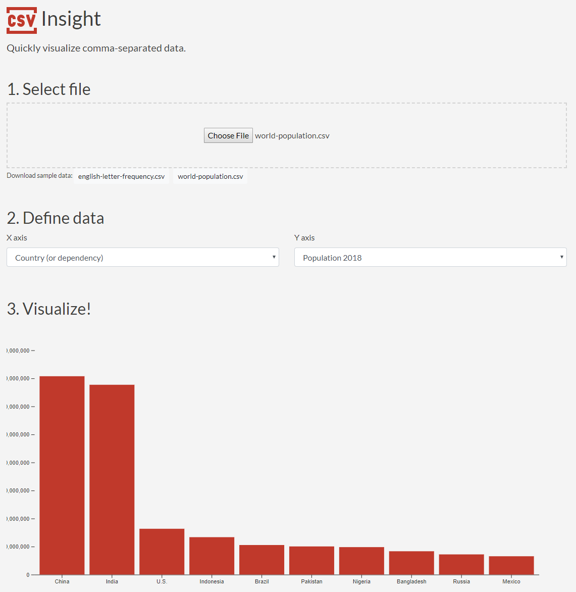

# CSV Insight

Quickly visualize comma-separated data.



## Getting Started

These instructions will get you a copy of the project up and running on your local machine for
development and testing purposes. See deployment for notes on how to deploy the project on a live
system.

### Prerequisites

You must have [Node.js](https://nodejs.org/en/) installed to develop and build this web app. The
recommended way to install also requires [Git](https://git-scm.com/).

### Installing

Open a terminal and clone the repository.

```
> git clone https://github.com/Hackbit/nko2018-csvinsight
```

Change into the project directory.

```
> cd nko2018-csvinsight
```

Install dependencies.

```
> npm install
```

Serve for development and watch for changes.

```
> npm run serve
```

Visit the web app served for development at http://localhost:8080

## Linting and fixing files

See and fix (if possible) lint errors

```
> npm run lint
```

## Deployment

### Compile and minify for production

```
npm run build
```

The built web app will be available in the `dist/` directory

### Deploy

```
npm start
```

The built app in `dist/` is served at the port in the `PORT` environment variable.

## Built with

- [Bootstrap](https://getbootstrap.com) - User interface styling
- [D3](https://d3js.org/) - Data visualization
- [Google Fonts](https://fonts.google.com) - The main font, Lato
- [Icons8](https://icons8.com/) - Project icon
- [Papa Parse](https://www.papaparse.com/) - In-browser CSV parser
- [Serve](https://github.com/zeit/serve#readme) - Static site server
- [Vue](https://vuejs.org/) - User interface management
- [Vuex](https://vuex.vuejs.org/) - State management

## Contributing

Built for [Node Knockout](https://www.nodeknockout.com/) 2018. Once the competition
is over, pull requests from everyone are welcome.

## Versioning

Uses [Semantic Versioning](https://semver.org/). For the versions available, see the
[tags on this repository](https://github.com/Hackbit/nko2018-csvinsight/tags).

## Authors

- **Travis Horn** - https://travishorn.com

## License

Licensed under the MIT License. See the [LICENSE](LICENSE) file for details.

## Acknowledgements

This project was built in 48 hours for the Node Knockout 2018 hackathon competition.
